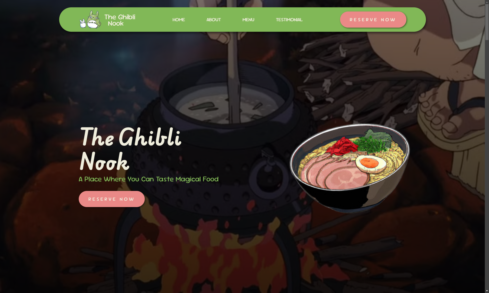
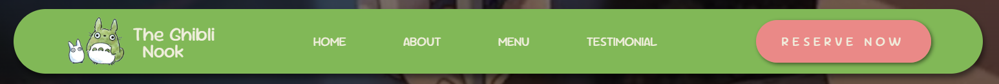
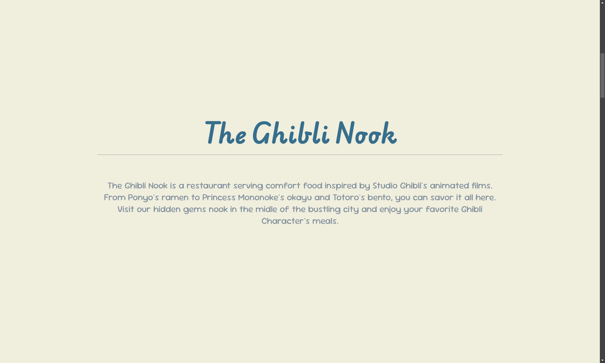
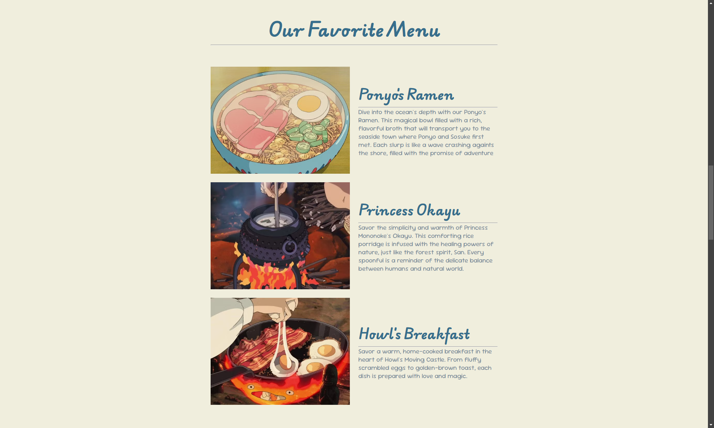
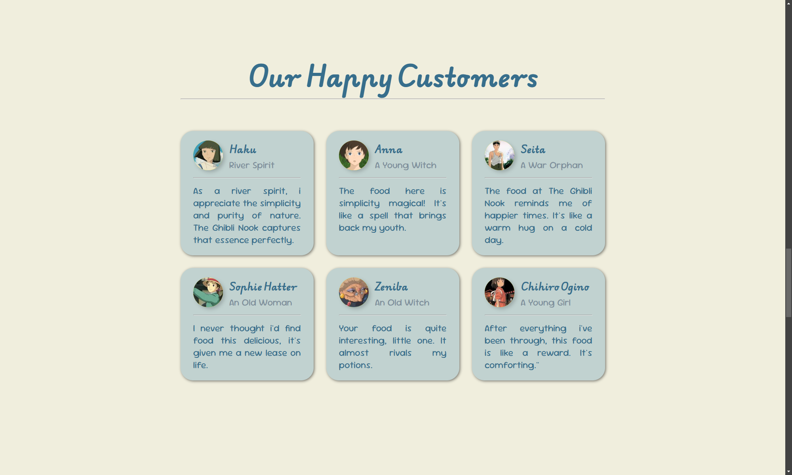
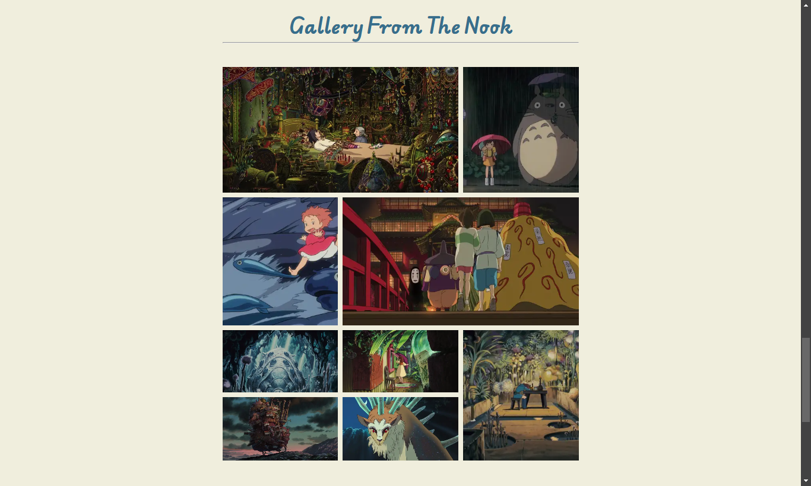
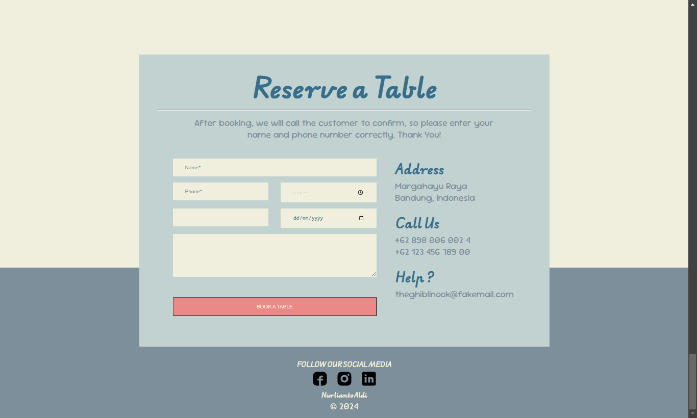
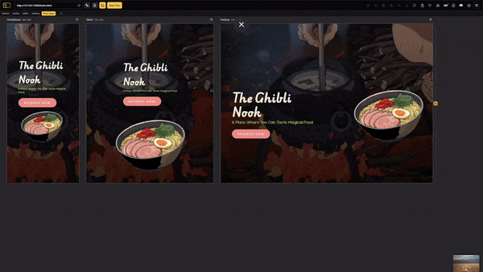

#### www.theghiblinook.my.id

# Welcome to The Ghibli Nook!

## The Ghibli Nook is a restaurant serving comfort food inspired by Studio Ghibli's animated films. 

From Ponyo's ramen to Princess Mononoke's Okayu and the famous Totoro's Bento, you can savor it all here. Visit our hidden gems nook in the midle of the bustling city and enjoy your favorite Ghibli Character's meals.

Note: oh, look, there is an ANIMATION!

## Get To Know Us

Use the NAVIGATION BAR our website to NAVIGATE BETWEEN SECTION. There is "HOME", "ABOUT", "MENU", "TESTIMONIAL", and a shortcut button to book a table at our restaurant, "RESERVE NOW". This website use SEMANTIC STRUCTURE so you won't get lost.

### Let's Dive Into Each of It

#### About - An Explanation About The Ghibli Nook

Note: This section specialize to FIT INTO YOUR VIEWPORT so the explanation exactly at the center of your screen so you can have the best experience when exploring our website

#### Menu - Our Speciality

Note: We only have three menu right now but coincidenly three of it serve as our customer favorite menu. The food IMAGE AND THE EXPLANATION DISPLAYED SIDE BY SIDE so you can easily imagining what food you will get.

#### Testimonial - Words from Our Happy Customers

Note: This section shows you a few testimonial from our happy customers in RESPONSIVE GRID LAYOUT. You must know a familiar name from it, right?

#### Gallery from The Nook

 Note: and there's a bonus section where you can see the ASYMETRICAL GRID GALLERY view of our activity at the restaurant.

 
 Note: and finally, you can reserve a tbale at our restaurant uisng the FORM and click that BUTTON after filling out your information.

 ### ACCESS FROM VARIOUS DEVICE

 Its okay if you want to open The Ghibli Nook Website from your phone or tablet, the RESPONSIVENESS will still make you enjoy the experience.

# Thanks for Reading This!